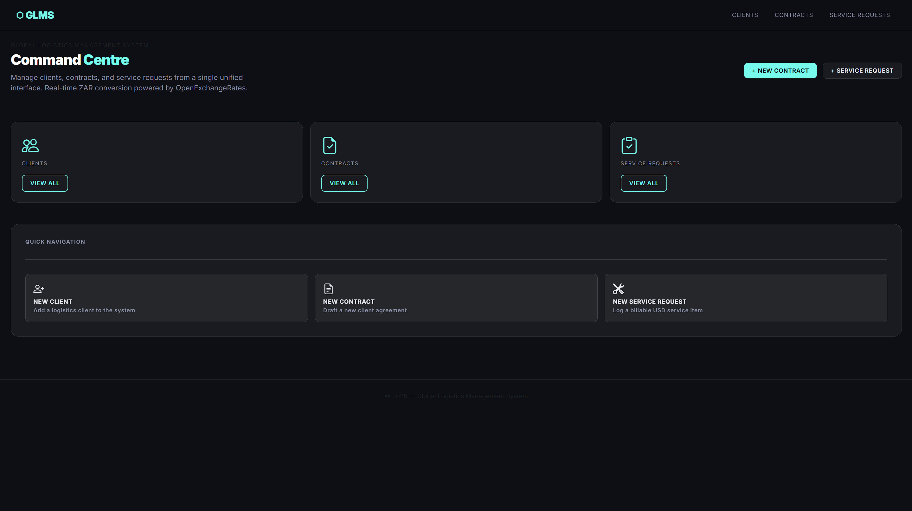
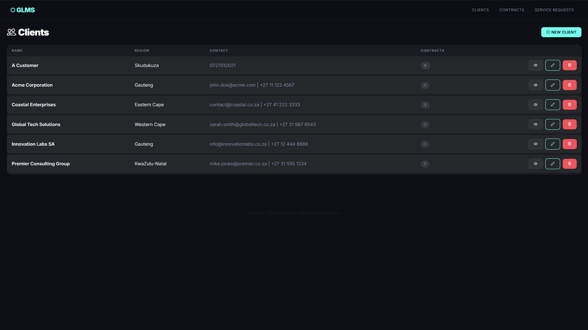
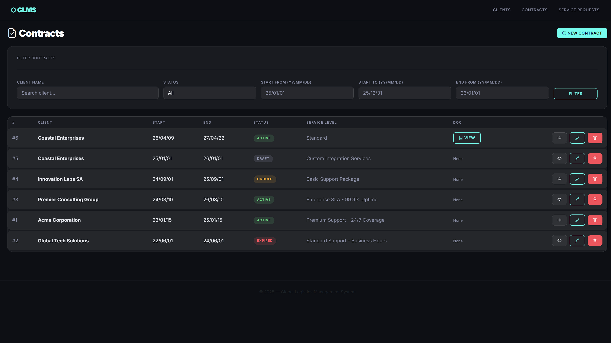
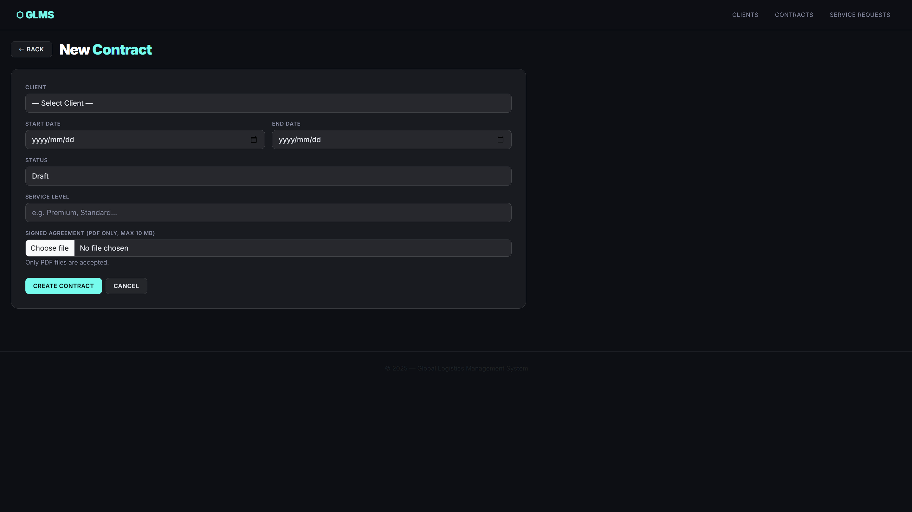
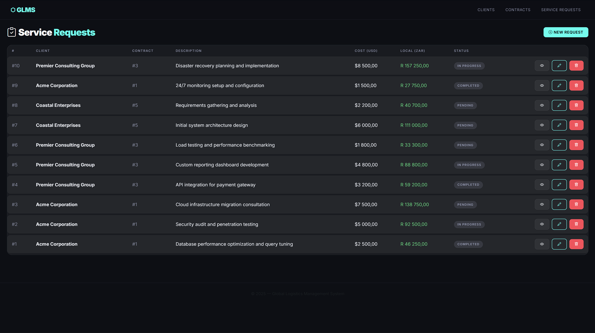
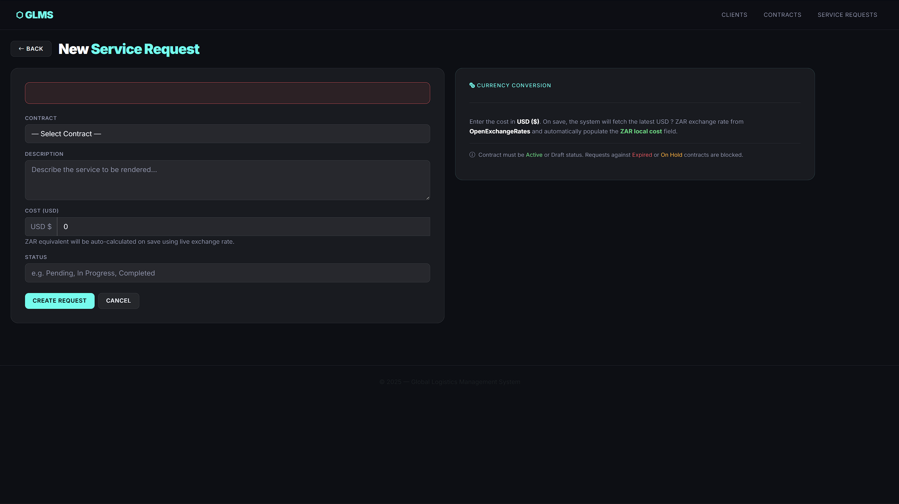
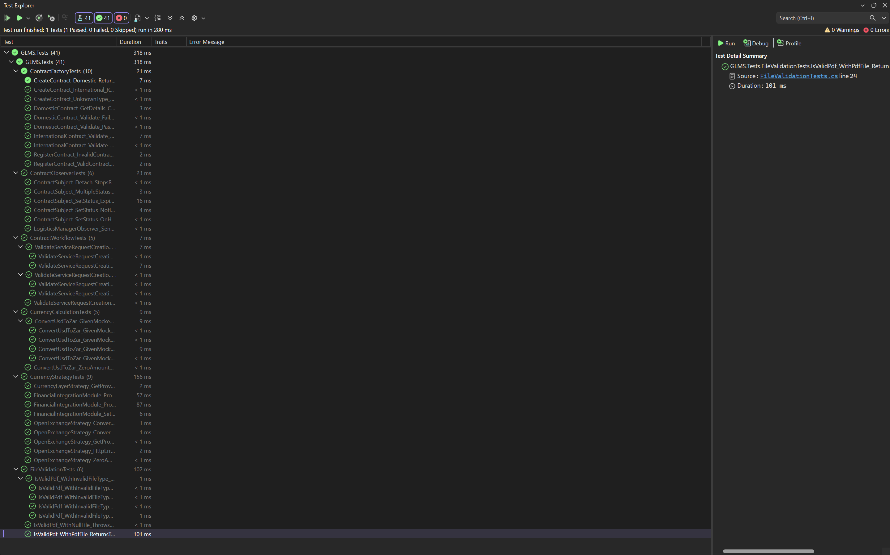
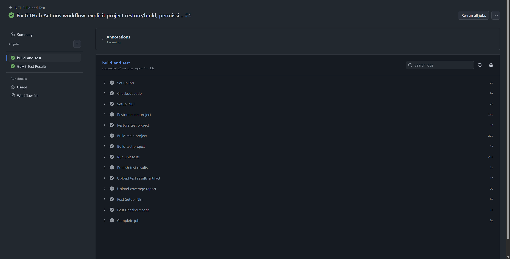

# GLMS — Global Logistics Management System

[](https://github.com/msa1105/PROG7311-POE/actions/workflows/dotnet.yml)

GLMS is an ASP.NET Core MVC web application for managing client contracts, service requests, and logistics workflows. It includes live USD-to-ZAR currency conversion, PDF contract file handling, strict business rule enforcement, and a full xUnit test suite with automated CI via GitHub Actions.

---

## Table of Contents

1. [Key Features](#key-features)
2. [System Requirements](#system-requirements)
3. [Setup and Installation](#setup-and-installation)
4. [Running the Application](#running-the-application)
5. [Running the Tests](#running-the-tests)
6. [Project Structure](#project-structure)
7. [Design Patterns](#design-patterns)
8. [Database Schema](#database-schema)
9. [API Integration](#api-integration)
10. [Screenshots](#screenshots)
11. [Known Limitations](#known-limitations)

---

## Key Features

| Feature | Description |
|---|---|
| Client Management | Create and maintain client records across regions |
| Contract Lifecycle | Full CRUD with status states: Draft, Active, OnHold, Expired |
| Service Requests | Requests linked to contracts; blocked on Expired/OnHold contracts |
| Currency Conversion | Live USD to ZAR via OpenExchangeRates API with decimal precision |
| PDF File Upload | UUID-named uploads with extension and MIME type validation |
| Contract Filtering | Filter by client name, status, and date ranges (yy/MM/dd) |
| Business Rules | Duplicate name detection, date ordering, file size cap (10 MB) |
| Design Patterns | Factory Method, Observer, and Strategy patterns fully implemented |
| Unit Testing | 41 xUnit tests with Moq mocking; 0 failures |
| CI/CD | GitHub Actions — builds and runs all tests on every push |

---

## System Requirements

**Development**

| Requirement | Version |
|---|---|
| Operating System | Windows 10/11, macOS, or Linux |
| IDE | Visual Studio 2022 v17.8+ or VS Code with C# Dev Kit |
| .NET SDK | 9.0 or higher |
| Database | SQL Server 2019+ or SQL Server LocalDB (Windows) |

**Runtime**

- .NET 9.0 Runtime
- SQL Server or SQL Server LocalDB
- Internet access for OpenExchangeRates API calls

---

## Setup and Installation

### 1. Clone the repository

```bash
git clone https://github.com/msa1105/PROG7311-POE.git
cd PROG7311-POE
```

### 2. Configure the database connection

Open `appsettings.json` and verify the connection string. The default targets SQL Server LocalDB:

```json
"ConnectionStrings": {
  "DefaultConnection": "Server=(localdb)\\mssqllocaldb;Database=GLMS_DB;Trusted_Connection=True;MultipleActiveResultSets=true"
}
```

Replace the value with your own SQL Server connection string if not using LocalDB.

### 3. Configure the OpenExchangeRates API key

In `appsettings.json`, replace the placeholder with your API key (free at [openexchangerates.org](https://openexchangerates.org)):

```json
"ExternalServices": {
  "OpenExchangeRates": {
    "BaseUrl": "https://openexchangerates.org/api/",
    "AppId": "YOUR_API_KEY_HERE"
  }
}
```

### 4. Restore NuGet packages

```bash
dotnet restore PROG7311-POE.csproj
dotnet restore GLMS.Tests/GLMS.Tests.csproj
```

### 5. Apply database migrations

```bash
dotnet ef database update
```

Or in the Visual Studio Package Manager Console:

```powershell
Update-Database
```

### 6. Seed data

The database is automatically seeded with mock records (5 clients, 5 contracts, 10 service requests) on first run. No manual step is required.

---

## Running the Application

**Visual Studio**

1. Open `PROG7311-POE.slnx`
2. Press `F5` or click **Start**

**Command line**

```bash
dotnet run --project PROG7311-POE.csproj
```

The application starts at the URL shown in the terminal (typically `https://localhost:7xxx`).

---

## Running the Tests

```bash
dotnet test GLMS.Tests/GLMS.Tests.csproj --verbosity normal
```

Expected output: **41 tests, 41 passed, 0 failed**.

The test suite covers:

| Test Class | Tests | What is covered |
|---|---|---|
| `CurrencyCalculationTests` | 5 | USD-to-ZAR decimal math and zero-amount edge case |
| `FileValidationTests` | 7 | PDF acceptance, `.exe` / non-PDF rejection, null file guard |
| `ContractWorkflowTests` | 5 | Expired/OnHold block, Active/Draft allow, null contract guard |
| `ContractFactoryTests` | 10 | Factory creation, validation pass/fail, registry logic |
| `ContractObserverTests` | 5 | Attach/detach/notify, compliance triggers, multi-status tracking |
| `CurrencyStrategyTests` | 9 | Strategy rounding, HTTP error handling, runtime strategy swap |

CI runs automatically on every push and pull request via GitHub Actions.

---

## Project Structure

```
PROG7311-POE/
├── Controllers/                  # Clients, Contracts, ServiceRequests, Home
├── Data/
│   ├── ApplicationDbContext.cs   # EF Core DbContext with Fluent API config
│   └── DbSeeder.cs               # Startup data seeder (10+ records)
├── Models/
│   ├── Client.cs
│   ├── Contract.cs
│   ├── ServiceRequest.cs
│   ├── ContractStatus.cs         # Enum: Draft, Active, OnHold, Expired
│   └── ViewModels/               # ContractFormViewModel, ServiceRequestFormViewModel
├── Patterns/
│   ├── Factory/                  # IContract, DomesticContract, InternationalContract, ContractFactory
│   ├── Observer/                 # IObserver, ContractSubject, LogisticsManagerObserver, ComplianceObserver
│   └── Strategy/                 # ICurrencyStrategy, OpenExchangeStrategy, CurrencyLayerStrategy, FinancialIntegrationModule
├── Services/
│   ├── CurrencyService.cs        # OpenExchangeRates HTTP client
│   ├── FileValidationService.cs  # Extension + MIME type validation
│   └── ContractWorkflowService.cs# Business rule enforcement
├── Views/                        # Razor views for all three entities
├── wwwroot/
│   └── uploads/contracts/        # UUID-named PDF contract files
├── GLMS.Tests/                   # xUnit + Moq test project (41 tests)
├── .github/workflows/dotnet.yml  # GitHub Actions CI pipeline
├── appsettings.json              # Connection string and API key configuration
├── Program.cs                    # Application entry point and DI registration
└── Database_Schema.sql           # Full SQL migration script
```

---

## Design Patterns

### Factory Method — `Patterns/Factory/`

Produces `DomesticContract` or `InternationalContract` instances from a single `GlmsContractFactory.CreateContract(type)` call. Validation runs before any contract is registered.

### Observer — `Patterns/Observer/`

`ContractSubject` maintains a list of `IObserver` subscribers. When `SetStatus()` is called, all attached observers are notified. `LogisticsManagerObserver` logs alerts; `ComplianceObserver` records violations on Expired or OnHold transitions.

### Strategy — `Patterns/Strategy/`

`FinancialIntegrationModule` holds an `ICurrencyStrategy` reference. The active strategy (`OpenExchangeStrategy` or `CurrencyLayerStrategy`) can be swapped at runtime via `SetStrategy()`. Both implementations use `decimal` arithmetic to prevent floating-point errors.

---

## Database Schema

The application uses EF Core Code-First migrations. The three core entities are:

| Table | Key columns |
|---|---|
| `Clients` | `Id`, `Name`, `ContactDetails`, `Region` |
| `Contracts` | `Id`, `ClientId` (FK), `StartDate`, `EndDate`, `Status`, `ServiceLevel`, `AgreementFilePath` |
| `ServiceRequests` | `Id`, `ContractId` (FK), `Description`, `Cost` (USD), `LocalCost` (ZAR), `Status` |

**Relationships**

- `Contracts.ClientId` → `Clients.Id` — restricted delete (cannot delete a client with active contracts)
- `ServiceRequests.ContractId` → `Contracts.Id` — cascade delete

See [`Database_Schema.sql`](Database_Schema.sql) for the full generated SQL script.

---

## API Integration

**OpenExchangeRates**

- Endpoint: `GET https://openexchangerates.org/api/latest.json?app_id={key}&symbols=ZAR`
- Used in: `CurrencyService.ConvertUsdToZarAsync()` and `OpenExchangeStrategy.Convert()`
- Error handling: `HttpRequestException` throws a user-friendly `InvalidOperationException`; controllers catch it and add a `ModelState` error without crashing
- Precision: all rates stored and computed as `decimal`

---

## Screenshots

> Screenshots are stored in [`docs/screenshots/`](docs/screenshots/).
> Add images to that folder and update the paths below.

### Home Page



### Client List



### Contract List with Filters



### Contract Create Form



### Service Request List



### Service Request Create — Currency Conversion



### Unit Test Results — All 41 Passing



### GitHub Actions CI — Build and Test



---

## Known Limitations

- The OpenExchangeRates free tier allows 1 000 API requests per month. If the quota is exceeded, currency conversion will show an error message and the form will not submit.
- File uploads are capped at 10 MB. This limit is enforced in both the ViewModel and the controller.
- SQL Server LocalDB is Windows-only. On macOS or Linux, configure a full SQL Server instance or use the SQL Server Docker image.

---

## Repository

[https://github.com/msa1105/PROG7311-POE](https://github.com/msa1105/PROG7311-POE)
